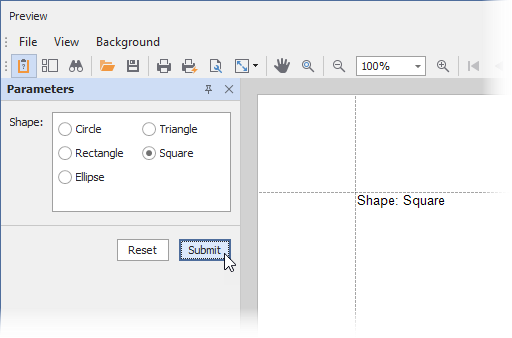

<!-- default badges list -->

<!-- default badges end -->
# Reporting for WinForms - Implement a Custom Parameter Editor

This example demonstrates how to replace a parameter's default editor with a custom editor ([radio group](https://docs.devexpress.com/WindowsForms/DevExpress.XtraEditors.RadioGroup)).

<!-- default file list -->

## Files to Look At

- [Form1.cs](./CS/XtraReport1.cs#L11) ([Form1.vb](./VB/XtraReport1.vb#L13))

<!-- default file list end -->

## Documentation

- [Implement a Custom Parameter Editor in WinForms Applications](https://docs.devexpress.com/XtraReports/5110)
- [Use Report Parameters](https://docs.devexpress.com/XtraReports/4812)
- [The Parameters Panel](https://docs.devexpress.com/XtraReports/402960)

